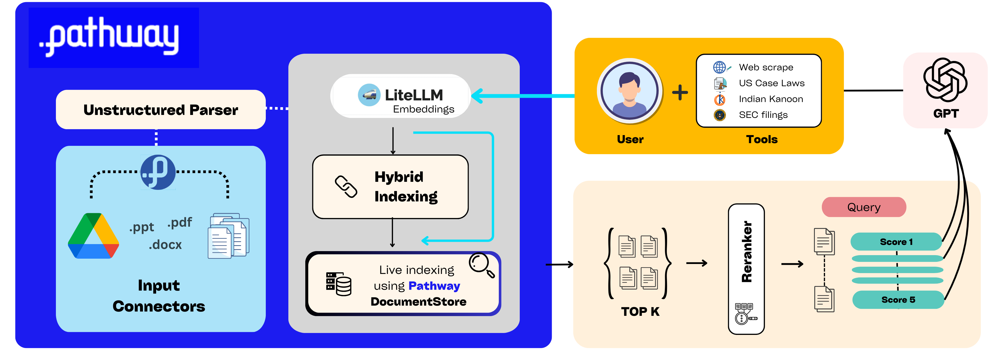

# Introduction  

This entire folder contains a full fledged RAG pipeline implemented using pathway's engine and its classes. It includes parsing , chunking , embedding , retrieving , reranking and response generation along with support for the same on user uploaded documents .


## Pathway Instances to support tool calls and user uploads   

``pw_new.py`` starts a pathway DocumentStoreServer instance that specifically indexes and monitors a folder that saves .txt files saved by web scrapers , legal research tools like Indian Kanoon, financial tools like get_sec_filings.  It indexes them into the document store and allows for realtime questioning and answering for these documents as they are fetched by the tool calls in our agentic pipeline. 
Whereas ``pw_userkb.py`` starts the same but monitors the user uploads folder.

Both of them have 3 endpoints and run on their separate ports (4004 and 4006)  : 

1. `/v1/retrieve`: Retrieves documents based on a query (has query and k as parameters)
2. `/v1/statistics`: Provides statistics about the document store
3. `/v1/inputs`: Lists all documents in the store 


## User Upload Server
``http_serve.py`` starts a basic uvicorn based file upload server which has a single endpoint at port ``8000`` named ``/uploads`` where a POST request is sent to upload a file which is then uploaded to a folder named uploads under the pathway_rag folder. 
  
## RAG server  :
``rag_server.py`` starts a server that has single endpoint ``/generate`` which based on the query retrives relevant chunks from any of the 2 document store servers based on a routing logic.

Sample curl request to make a simple get request to generate a response.

```
curl -X POST "http://localhost:4005/generate" \
     -H "Content-Type: application/json" \
     -d '{"query": "what are the net product sales of AMZN in 2022 ?"}'

```
